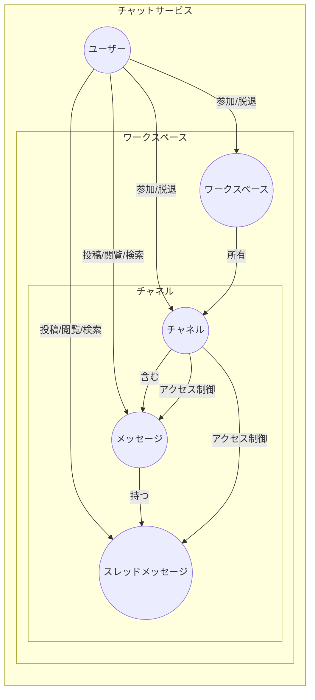

## 課題整理

1. メッセージ
2. スレッドメッセージ
3. チャネル
4. ユーザー

```mermaid

graph LR
  subgraph "チャットサービス"
    User((ユーザー))
    subgraph "ワークスペース"
      Workspace((ワークスペース))
      subgraph "チャネル"
        Channel((チャネル))
        Message((メッセージ))
        ThreadMessage((スレッドメッセージ))
      end
    end
  end

  %% ユーザーの操作
  User -->|参加/脱退| Workspace
  User -->|参加/脱退| Channel
  User -->|投稿/閲覧/検索| Message
  User -->|投稿/閲覧/検索| ThreadMessage

  %% エンティティの関係
  Workspace -->|所有| Channel
  Channel -->|含む| Message
  Message -->|持つ| ThreadMessage

  %% 制約
  Channel -->|アクセス制御| Message
  Channel -->|アクセス制御| ThreadMessage
```

## メモ

- メッセージとスレッドメッセージは、同じテーブルに保存して良さそう
- ポインタを使って、スレッドメッセージがどのメッセージに対して投稿されたのかを示す
  - ルートのメッセージは、ポインタを持たない
