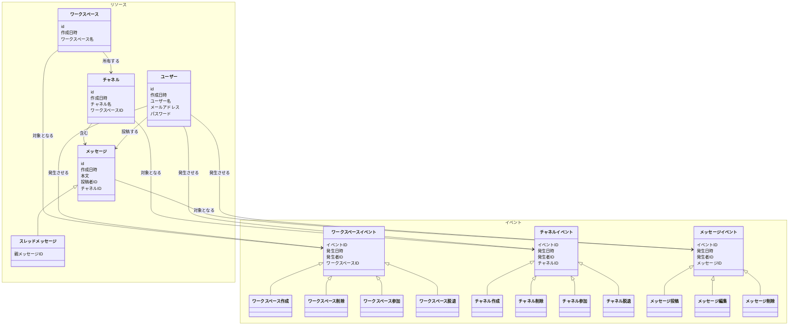
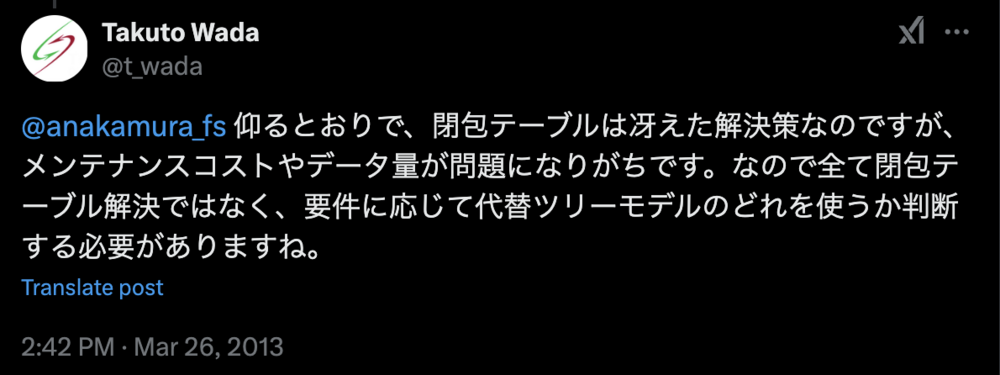

# データモデリング2 課題1-1

- イミュータブルモデリングを採用
  - データモデル -> DDL -> DML -> クエリサンプルの流れで設計を進めました

## 1. データモデル

### 概要

- テーブル設計の前段階として、データモデルをクラス図で表現しています
- テーブル設計に落とし込む際には、データモデルをどう表現するか？という視点で設計を進めました

### データモデルの特徴

- データモデルのエンティティは必ずしもテーブルと1:1対応していません
- サブクラス/スーパークラスのエンティティをUMLのクラス図を使用して継承関係として表現しています
- 参考
  - web+db_press_vol.130 イミュータブルデータモデルで始める実践データモデリング
  - https://www.slideshare.net/slideshow/ss-40471672/40471672
  - https://scrapbox.io/kawasima/イミュータブルデータモデル

## 2. ERD

### 概要
- [1. データモデル](#1-データモデル)をテーブル設計に落とし込んだER図

### 設計方針
1. **テーブル統合/分割の判断基準**
- 下記２点を判断基準として、データモデルのエンティティを統合/分割してテーブルを設計しました
  - 属性の類似性
  - 横断検索の必要性
- 参考
  - https://scrapbox.io/kawasima/イミュータブルデータモデル#5e3a5f1da8e5b200009c051f

###　データモデル→ERDの変更点
1. **メッセージ/スレッドメッセージの統合**
  - メッセージとスレッドメッセージを統合
  - 統合理由：属性の共通性が高いかつ、横断検索が必要
2. **スレッドメッセージの階層構造の表現**
  - スレッドのメッセージ一括取得しやすいよう閉包テーブルを採用してます
  - 当初ナイーブツリーで考えてましたが、再起クエリが必要になるので今回のケースでは適さないと判断しました

3. **ワークスペース(チャネル)のイベントの分割**
- ~~`workspace_member_events`と`workspace_lifecycle_events`に分割~~
- 分割理由：イベントの種類によって属性が異なる/大きく2つに分けられるため
   - もともとのデータモデルにはなかったが、ERDを書いた段階で気づきました
    - ワークスペースメンバーがそもそもエンティティとして存在する -> データモデルにも反映した方が良さそう
    - 今回はテーブル設計のみに用するデータモデルなので、そのままにしています
- 今回の要件から、`workspace_lifecycle_events`は不要だと判断したので削除しました
  - 「名称変更などの更新要件がない」かつ「削除するときは物理削除で良さそう」と判断したため

4. `スレッドの表現`
- 表現方法調べた結果、閉包テーブルパターンがよさそうだったので採用しました
  - チャットアプリでは「スレッド内の全メッセージを一括取得する」ユースケースが多そう
  - → 閉包テーブルなら再帰クエリなしで効率的に取得できる
- 最初、親メッセージへの外部キーを持たせた単純なツリー構造（ナイーブツリー）を採用していました
- しかし、再帰クエリが必要になりスレッドが深くなるとパフォーマンスが悪そうと思い調べた結果、閉包テーブルパターン良さそうだなと思いました
  - メンテナンスコストとパフォーマンスは注意必要そう
    - 
- 参考
  - https://note.com/standenglish/n/n0f11205f154e

## 3. DDL

- [DDL.sql](src/DDL.sql)

## 4. DML

- 初期データ投入用のSQLファイルです
- [DML.sql](src/DML.sql)

## 5. クエリサンプル

- 下記参照
- [query.sql](src/queries.sql)

## 気になるポイント

- 1. **イミュータブルモデルにおける最新状態の管理**
  - イミュータブルモデルの場合最新状態をどうやって取得するか？かなり悩みました。
  - 今回は、削除と更新をイベントとして記録することで、取得することを想定しています
  - `messages`テーブルと`message_events`テーブルを外部結合して、最新の状態を取得する(最新時刻のイベントと結合して取得)
- 2. **イベント種類の表現**
  - `xxx_events`のテーブルでイベント種別をどのように表現するか？
    - Enum, マスタテーブル, 文字列 など
    - あまり大差はなさそうなイメージ
    - あまり重要じゃはないかも 
- 3. **イミュータブルモデルにおけるデータ量の問題**
  - INSERT主体なのでデータ量が増えることに対しては考慮が必要かと思います
  - 一部更新可能にするとか、最新の状態だけ保持するとか?どういった対応が考えられるか？
- 4. **ワークスペースの閲覧権限を制御**
  - マルチテナントの問題
  - RLSを使うのはどうか？と思いました
  - 知見あれば教えてください
  - 参考
    - https://zenn.dev/nstock/articles/multi-tenant-saas-using-rls
- 5. **メンバー加入・脱退のイベント不要説**
  - ユースケースを考えると、メンバーの加入/脱退は、イベントにする必要ない気もしました。
  - 「最新の状態だけ分かれば良さそう → 過去の状態は不要ではないか？」と思ったため
  - その場合、下のような変更をすることになるかもしれません
    - `workspace_member_events`, `channel_member_events`を削除
    - `workspace_members`, `channel_members` は物理削除して、INERT/DELETEのみでメンバーを管理する
- 6. **ユーザー削除が生じた場合の対応**
  - 今回の要件にはありませんが、気になった
  - まず浮かんだのは、ユーザーイベントテーブルみたいなものを作って、そこに削除イベントを入れる
    - 保守性を考えると疑問もある
    - いちいちユーザーイベントテーブルを結合して、最新のレコードを判定しないとダメそう
    - たまに`削除されたユーザー`みたいな表示を見ることがある
