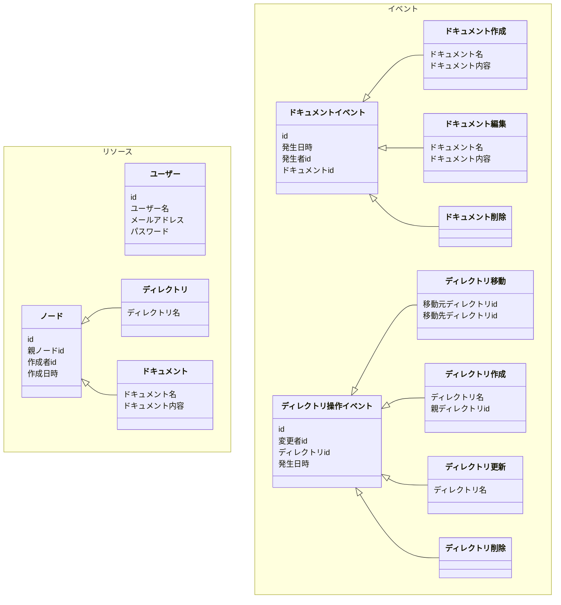
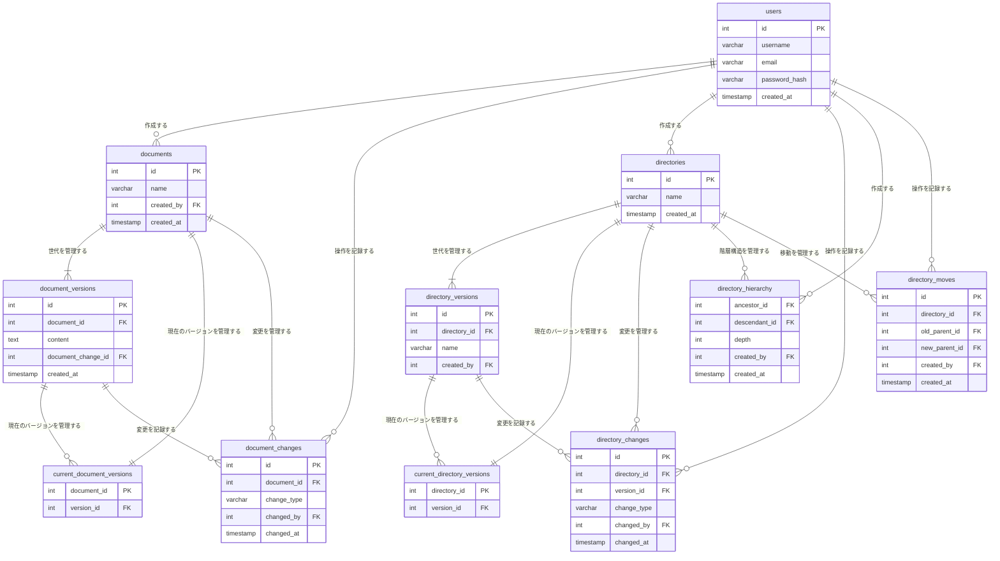

# データモデリング2 課題1-1

- ドキュメント管理のデータベースを設計する
- イミュータブルモデリングを採用

## 1. データモデル

ドキュメント管理のデータベースを設計する。

```mermaid
classDiagram 
    namespace リソース {
        class ユーザー {
            id
            ユーザー名
            メールアドレス
            パスワード
        }
        class ノード {
          id
          親ノードid
          作成者id
          作成日時
        }
        class ディレクトリ {
            ディレクトリ名
        }
        class ドキュメント {
            ドキュメント名
            ドキュメント内容
        }
    }
    ノード <|-- ディレクトリ
    ノード <|-- ドキュメント

    namespace イベント {
        class ドキュメントイベント {
            id
            発生日時
            発生者id
            ドキュメントid
        }
        class ドキュメント作成 {
            ドキュメント名
            ドキュメント内容
        }
        class ドキュメント編集 {
            ドキュメント名
            ドキュメント内容
        }
        class ドキュメント削除 

        class ディレクトリ操作イベント {
          id
          変更者id
          ディレクトリid
          発生日時
        }
        class ディレクトリ移動 {
          移動元ディレクトリid
          移動先ディレクトリid
        }
        class ディレクトリ作成 {
          ディレクトリ名
          親ディレクトリid
        }
        class ディレクトリ更新 {
          ディレクトリ名
        }
        class ディレクトリ削除 {
        }
    }

    ドキュメントイベント <|-- ドキュメント作成
    ドキュメントイベント <|-- ドキュメント編集
    ドキュメントイベント <|-- ドキュメント削除
    ディレクトリ操作イベント <|-- ディレクトリ移動
    ディレクトリ操作イベント <|-- ディレクトリ作成
    ディレクトリ操作イベント <|-- ディレクトリ更新
    ディレクトリ操作イベント <|-- ディレクトリ削除

```

## 2. ER図

- イミュータブルモデリングを採用しています
  - 特に記載がなければ、`INSERT`のみを許容するテーブルです
  - https://scrapbox.io/kawasima/イミュータブルデータモデル
- `documents`,`directories`の世代管理は`世代バージョンタグ付けパターン`を採用
  - WEB+DB PRESS編集部. WEB+DB PRESS Vol.130 (p.90). 株式会社技術評論社. Kindle 版. 
- `directories`の階層構造は`閉包テーブル`を採用
  - あるディレクトリ以下の全てのディレクトリを取得する際に有効
  - ディレクトリを取得して、そのディレクトリに対してドキュメントを取得する
  - https://qiita.com/kondo0602/items/de92eaf6d2bd7f57a74c
- ドキュメント/ディレクトリは、`CCI(Concrete Class Inheritance`)を採用
- ドキュメントの操作イベントは、`STP(Single Table Inheritance)`を採用
- ディレクトリの操作イベントは、移動のみ`CCI`でテーブル作成して、残りは`STP`でまとめた

```mermaid
erDiagram

  %% ユーザー(R)
  %% 今回はユーザーの更新は考慮しない
  users {
    int id PK
    varchar username
    varchar email
    varchar password_hash
    timestamp created_at
  }
  %% ドキュメント(R)
  documents {
    int id PK
    varchar name
    int created_by FK
    timestamp created_at
  }
  document_versions {
    int id PK
    int document_id FK
    text content
    int document_change_id FK
    timestamp created_at
  }
  %% 現在のバージョン
  %% `UPDATE`,`DELETE`を許容するテーブル
  %% 削除した場合は、
  current_document_versions {
    int document_id PK
    int version_id FK 
  }
  %% STPで作成/更新/削除の操作履歴を管理
  document_changes {
    int id PK
    int document_id FK
    varchar change_type
    int changed_by FK
    timestamp changed_at
  }

  %% ディレクトリ(R)
  directories {
    int id PK
    varchar name
    timestamp created_at
  }
  directory_versions {
    int id PK
    int directory_id FK
    varchar name
    int created_by FK
  }
  %% 現在のバージョン
  %% `UPDATE`,`DELETE`を許容するテーブル
  current_directory_versions {
    int directory_id PK
    int version_id FK
  }
  %% STPで作成/更新/削除の操作履歴を管理
  directory_changes {
    int id PK
    int directory_id FK
    int version_id FK
    varchar change_type
    int changed_by FK
    timestamp changed_at
  }

  %% ディレクトリの階層構造(閉包テーブル)
  %% `DELETE`を許容する
  %% ディレクトリ移動の場合は閉包テーブルのレコードを`DELETE`して、再度`INSERT`する
  directory_hierarchy {
    int ancestor_id FK
    int descendant_id FK
    int depth
    int created_by FK
    timestamp created_at
  }
  %% ディレクトリの移動
  %% ディレクトリはバージョン管理せず、移動前後の親ディレクトリを保持
  %% 取り消しは、逆の移動を行う
  directory_moves {
    int id PK
    int directory_id FK
    int old_parent_id FK
    int new_parent_id FK
    int created_by FK
    timestamp created_at
  }

  %% リレーションシップ
  %% 主要なリレーションシップのみ記載
  users ||--o{ documents : "作成する"
  users ||--o{ document_changes : "操作を記録する"
  users ||--o{ directories : "作成する"
  users ||--o{ directory_changes : "操作を記録する"
  users ||--o{ directory_hierarchy : "作成する"
  users ||--o{ directory_moves : "操作を記録する"
  
  documents ||--|{ document_versions : "世代を管理する"
  documents ||--|| current_document_versions : "現在のバージョンを管理する"
  documents ||--o{ document_changes : "変更を管理する"
  
  document_versions ||--o{ current_document_versions : "現在のバージョンを管理する"
  document_versions ||--o{ document_changes : "変更を記録する"
  
  directories ||--|{ directory_versions : "世代を管理する"
  directories ||--|| current_directory_versions : "現在のバージョンを管理する"
  directories ||--o{ directory_changes : "変更を管理する"
  directories ||--o{ directory_hierarchy : "階層構造を管理する"
  directories ||--o{ directory_moves : "移動を管理する"
  
  directory_versions ||--o{ current_directory_versions : "現在のバージョンを管理する"
  directory_versions ||--o{ directory_changes : "変更を記録する"

```

## 3. DDL

- [DDL.sql](src/1-DDL.sql)

## 4. DML

- [DML.sql](src/2-DML.sql)

## 5. クエリサンプル

- [queries.sql](src/3-queries.sql)

## memo 設計時の悩みなど

### ディレクトリ移動履歴(階層構造のバージョン管理)が難しい
- 変更は閉包テーブルの複数レコードに対して行われる
  - 1つの操作で複数のレコードがINSERTされる
- ディレクトリの削除/作成があった場合の管理がきつい
  - 削除/作成の履歴とは別管理とした
  - `Git`を思い浮かべると、削除と追加で移動を表現していたのでそれもありかも
-	最終的にはディレクトリ移動時の操作は以下を想定した
  -	移動対象ディレクトリの既存の親子関係を全削除
  -	新しい親ディレクトリとの関係を全てINSERT
  -	移動対象以下のサブディレクトリについても同様の操作を実施

### txの実践
- 当初kawashimaさんの下記記事を参考に実践しようとしたが断念した
  - <https://scrapbox.io/kawasima/履歴、世代、そして削除についての究極の疑問の答え>
