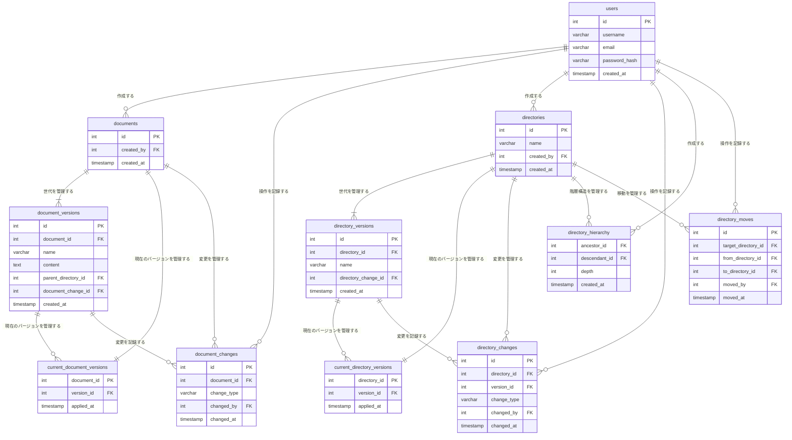

# データモデリング2 課題1-1

- ドキュメント管理アプリのデータベース設計
- イミュータブルモデリングを採用
  - 論理設計モデルはclass図で表現し、イベント/リソースに分類してエンティティを抽出した
  - 物理設計モデルはER図で表現
- ユーザー周りのデータモデルは今回の課題の首題ではないと判断し、最低限の要件を満たすよう設計した。
  - ユーザーの更新/削除は考慮していない
- ドキュメントの階層構造は`閉包テーブル`を採用
- 課題要件はないが、イミュータブルモデリングを実践するためドキュメント/ディレクトリの世代管理を行った
  - ドキュメントとディレクトリの世代管理は`世代バージョンタグ付けパターン`を採用


## 設計のポイント

### 移動履歴の実装
- 移動履歴はディレクトリの作成・更新・削除の履歴とは別に管理
  - Gitでは移動を削除と追加の組み合わせで表現するのとは異なる
- ディレクトリ移動操作の際には以下の操作を行う想定
  1. 移動対象ディレクトリの既存の親子関係を全て削除
  2. 新しい親ディレクトリとの関係を全て`INSERT`
  3. 移動対象以下のサブディレクトリについても同様の操作を実施

### 階層構造の変更追跡
- ディレクトリの階層構造はversion管理にしなかった
  - 理由は以下
    - `directory_histories`のテーブルはディレクトリの移動に加えて、ディレクトリ作成/削除でもトランザクションが発生する
    - 1つ１つのレコードをバージョン管理すると複雑
      - 閉包テーブルの複数レコードに影響する
    - そもそも交差エンティティをバージョン管理する必要があるのか？という疑問
    - ディレクトリ移動自体は可逆的な操作なので、移動履歴を管理するだけで十分と判断した

### ドキュメントの親ディレクトリの管理
- `document_versions`に`parent_directory_id`を持たせるとDMLやクエリが書きづらい
- どちらかに変更した方が良いかもしない
  - ① `document_versions`での管理ではなく交差エンティティテーブルを作成
  - ② ディレクトリとドキュメントの両方が継承する抽象的な「ノード」テーブルを実装し、階層構造を統一的に管理

## トランザクション管理(余談)
- 当初、川島さんの記事を参考に実装を検討したが断念した
  - 参照: https://scrapbox.io/kawasima/履歴、世代、そして削除についての究極の疑問の答え
- 紆余曲折あったが今の形でも履歴追跡はできるため、世代管理という観点でも特に問題ないかも

## 1. データモデル


## 2. ER図

- イミュータブルモデリングを採用しています
  - 特に記載がなければ、`INSERT`のみを許容するテーブルです
  - https://scrapbox.io/kawasima/イミュータブルデータモデル
- `documents`,`directories`の世代管理は`世代バージョンタグ付けパターン`を採用
  - WEB+DB PRESS編集部. WEB+DB PRESS Vol.130 (p.90). 株式会社技術評論社. Kindle 版. 
- `directories`の階層構造は`閉包テーブル`を採用
  - あるディレクトリ以下の全てのディレクトリを取得する際に有効
  - ディレクトリを取得して、そのディレクトリに対してドキュメントを取得する
  - https://qiita.com/kondo0602/items/de92eaf6d2bd7f57a74c
- ドキュメント/ディレクトリは、`CCI(Concrete Class Inheritance`)を採用
- ドキュメントの操作イベントは、`STP(Single Table Inheritance)`を採用
- ディレクトリの操作イベントは、移動のみ`CCI`でテーブル作成して、残りは`STP`でまとめた



## 3. DDL

- [DDL.sql](src/1-DDL.sql)

## 4. DML

- [DML.sql](src/2-DML.sql)

- 初期データのディレクトリツリーは以下のようになっています

```plaintext

ROOT (directories, ID=1)
├── Documents (directories, ID=2)
│   ├── ProjectPlan (documents, ID=1)
│   └── 議事録 (documents, ID=2)
├── Wiki (directories, ID=3)
│   └── WikiHome (documents, ID=3)
├── Develop (directories, ID=4)
│   └── DevSetup (documents, ID=4)
└── Manual (directories, ID=5)
    ├── Manual1 (documents, ID=5)
    └── Manual2 (documents, ID=6)
```

## 5. クエリサンプル

- [queries.sql](src/3-queries.sql)

### 1. ドキュメントの作成

### 2. ドキュメントの編集

### 3. ドキュメントの削除

### 4. ディレクトリの移動

7のクエリで確認

- Before
  
| document_id | document_name | document_content | created_by | version_created_at      | parent_directory_name |
|-------------|---------------|------------------|------------|-------------------------|-----------------------|
| 3           | WikiHome      | # Wikiホーム        | admin      | 2025-03-06 10:12:05.719 | Wiki                  |

- After

| document_id | document_name | document_content | created_by | version_created_at      | parent_directory_name |
|-------------|---------------|------------------|------------|-------------------------|-----------------------|
| 4           | DevSetup      | セットアップ手順       | member1    | 2025-03-06 10:03:06.596 | Develop               |
| 3           | WikiHome      | # Wikiホーム        | admin      | 2025-03-06 10:03:06.591 | Wiki                  |

   
### 5. 最新のドキュメント一覧取得

| document_id | document_name | current_content | created_by_user | created_at              |
|-------------|---------------|-----------------|-----------------|-------------------------|
| 6           | Manual2       | # ユーザーマニュアル2    | member1         | 2025-03-06 04:04:05.570 |
| 5           | Manual1       | # ユーザーマニュアル1    | admin           | 2025-03-06 04:04:05.567 |
| 4           | DevSetup      | セットアップ手順      | member1         | 2025-03-06 04:04:05.563 |
| 3           | WikiHome      | # Wikiホーム       | admin           | 2025-03-06 04:04:05.560 |
| 2           | 議事録        | ミーティングの議事録   | member1         | 2025-03-06 04:04:05.557 |
| 1           | ProjectPlan   | Hoge            | admin           | 2025-03-06 04:04:05.551 |

### 6. ドキュメントの編集履歴一覧取得

- 1-3の操作を行った場合の履歴

| document_name | change_type | changed_by_user | changed_at              | content_at_change |
|---------------|-------------|-----------------|-------------------------|-------------------|
|               | DELETE      | admin           | 2025-03-06 19:04:37.561 |                   |
| 新しいドキュメント    | UPDATE      | admin           | 2025-03-06 19:04:25.595 | 更新されたドキュメント     |
| 新しいドキュメント    | CREATE      | admin           | 2025-03-06 19:03:13.070 | 新しいドキュメントです      |

- `DELETE`の記録内容も`document_name`と`content`残した方が良いかも
- 変更後の状態を記録するという一貫性がなくなるので迷うところ

### 7. 特定ディレクトリ以下のドキュメントの一覧取得
   
| document_id | document_name | document_content | created_by | version_created_at      | parent_directory_name |
|-------------|---------------|------------------|------------|-------------------------|-----------------------|
| 6           | Manual2       | # ユーザーマニュアル2     | member1    | 2025-03-06 04:04:05.573 | Manual                |
| 5           | Manual1       | # ユーザーマニュアル1     | admin      | 2025-03-06 04:04:05.569 | Manual                |
| 4           | DevSetup      | セットアップ手順       | member1    | 2025-03-06 04:04:05.565 | Develop               |
| 2           | 議事録        | ミーティングの議事録    | member1    | 2025-03-06 04:04:05.559 | Documents             |
| 1           | ProjectPlan   | Hoge             | admin      | 2025-03-06 04:04:05.553 | Documents             |
