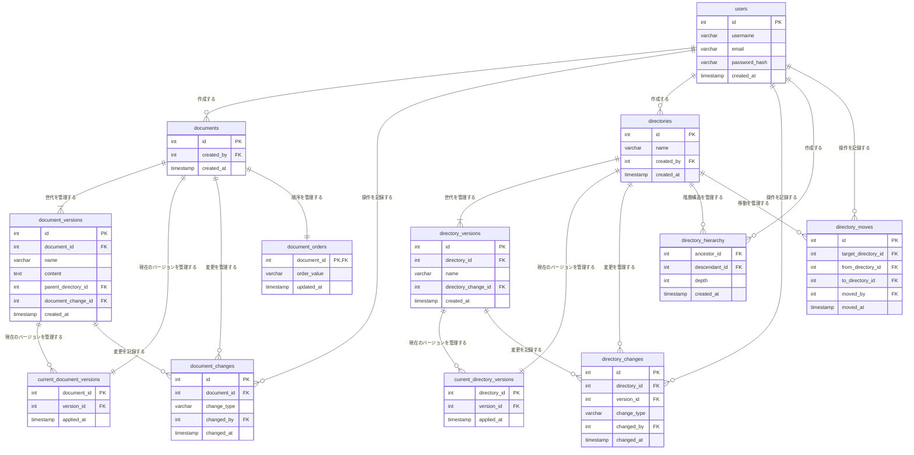

# ディレクトリ内のドキュメントの順番変更への対応

- Fractional Indexingを使用して、ディレクトリ内のドキュメントの順番変更への対応する
  - `document_versions`テーブルに`order`カラムを追加する
  - `base62`エンコードを使用して、`order`カラムの辞書順でドキュメントの順番を表現する
    - 参考：https://qiita.com/hamabek/items/281c2d79d3264d1d265b
- 更新対象の１レコードのみを更新することで、DBへの書き込みを最小限に抑えるため

- カラムを実装するテーブルは、新規に作成する
- 下記の3案を考えて案3を採用した
  - 案1
    - `document_versions`テーブルに`order`カラムを追加する
    - 表示順も履歴管理の対象とする場合
    - 並び替えを頻繁にする場合は、大量のバージョンが発生するので微妙そう
  - 案2
    - `documents`テーブルに`order`カラムを追加する
    - 履歴管理不要として、`document_versions`テーブルから`order`カラムを削除する
  - 案3
    - `document_orders`テーブルを作成する
    - `document_orders`テーブルに`document_id`と`order`を持たせる
    - 履歴管理はせずに、最新の`order`を取得する
- 理由は、履歴管理が不要な情報を分離する＋既存のテーブルと債務を分けるため
  - ドキュメントの順序管理は、ドキュメントの内容とは別々に扱うことになりそう
  - 並び替えるときに、一緒にファイル名を変更することもないし、`documents`テーブルに持たせるのも違うと思った
  - `documents`はあくまでもエンティティの同一性を扱うテーブル(戸籍謄本のようなもの)という考え方

## 参考
- `Fractional Indexing`についは、私のscrapboxにもまとめてます
  - https://scrapbox.io/KJR020/Fractional_Indexing

