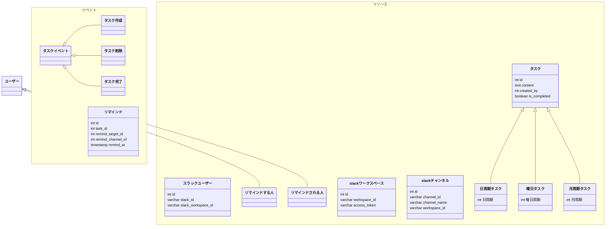
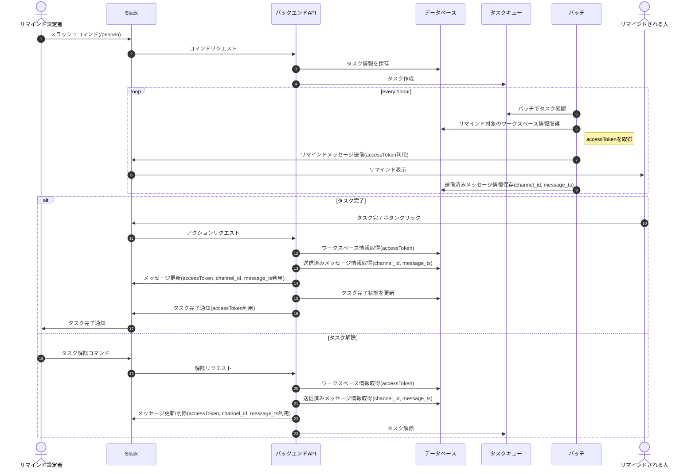
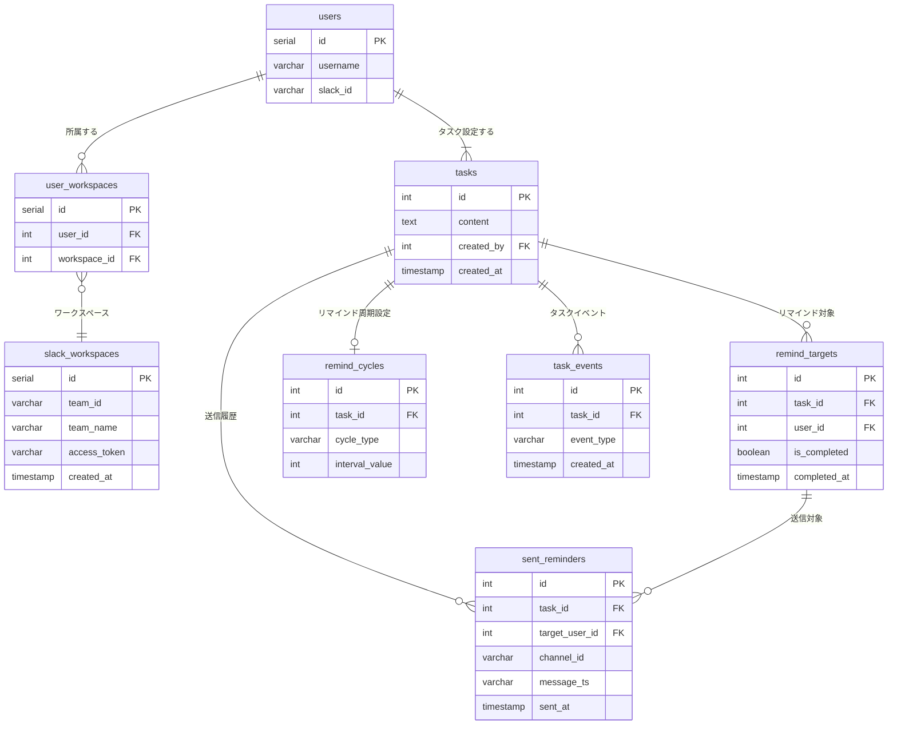

# データモデリング2 課題1-1

リマインダーアプリのDB設計

## 1. データモデル

> API側でhttps://slack.com/api/oauth.v2.accessに対して、先ほど取得したcode,clientId,clientSecretなどを含めて送信します。
  

- 複数ユーザーに通知を出せる
- タスクの完了状態はユーザーごと管理とする
  - 誰かが完了したらOKというタスクは設定しない

## 2. ER図

## 3. DDL

- [DDL.sql](src/1-DDL.sql)

## 4. DML

- [DML.sql](src/2-DML.sql)

## 5. クエリサンプル

- [queries.sql](src/3-queries.sql)
