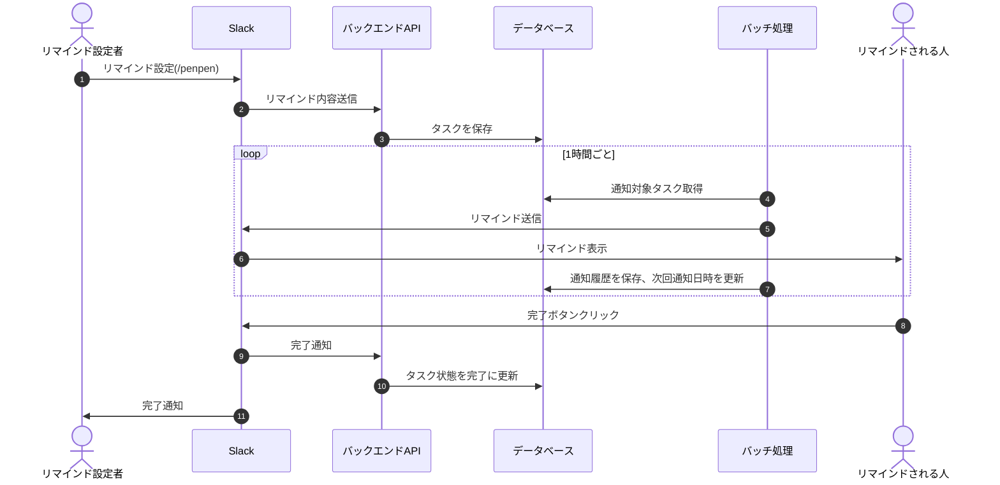
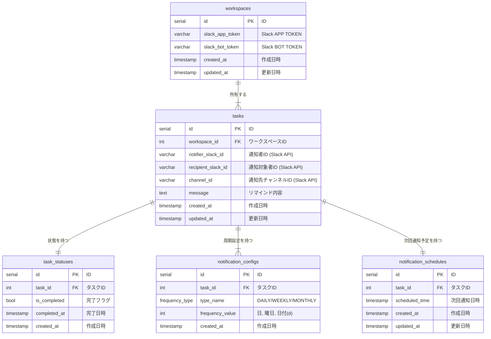

# データモデリング2 課題1-1

## 概要

### 要件

- 複数ユーザーに通知を送信できる
- タスクの完了状態はユーザーごとに管理する
  - 複数のユーザーで完了状態を共有するタスクはサポートしない

### 仕様

- 周期は日ごと/曜日/日付の3種類
  - EAVになるが、
  - 値は全てintで管理する
    - 日: x日ごと
    - 曜日: ISO8601の形式で指定する
      - 月曜日1、日曜日は7
      - 参考: <https://ja.wikipedia.org/wiki/ISO_8601>
    - 日付: m月d日のdを指定する
      - 31日など、存在しない場合は前詰めで最後の日にする
- SlackのAPP/BOT_TOKENは暗号化して保存する
  - 暗号化はアプリケーション側で実行
  - BASE64でエンコードする想定のため、データ型は`VARCHAR`で保存する
- リマインドの通知は１時間がごとに通知が必要なタスクを確認し、通知する
  - `tasks`の`scheduled_time`と`is_completed`を確認する
  -`scheduled_time`が直近１時間以内かつ`is_completed=false`の`tasks`を取得する
- 通知後に以下の処理を行う
  - 次回通知時間を計算し、`scheduled_time`を更新する

### シーケンス

## 2. ER図

## 3. DDL

- [DDL.sql](src/1-DDL.sql)

## 4. DML

- [DML.sql](src/2-DML.sql)

## 5. クエリサンプル

- [queries.sql](src/3-queries.sql)
