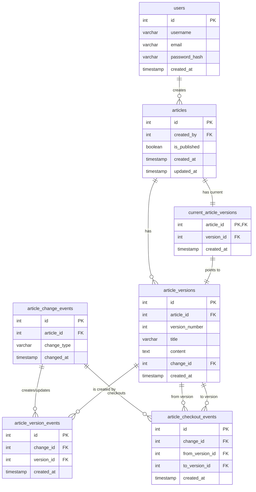

# データモデリング5 課題1-1

## ER図

## 設計

- 概要
  - イミュータブルデータモデリングを採用
  - 課題3のテーブル設計と同様のテーブル設計になっています
  - バージョン管理は、kawashimaさんの世代バージョンタグ付けパターンを参考にしました

- `articles` テーブルは記事の作成者、公開状態を保持
  - `UPDATE`を許容して、最新の公開状態を保持する
  - 記事の実際の内容は `article_versions` テーブルに保存

- 記事の変更操作は `article_change_events` テーブルに記録
  - 作成(`CREATE`)、更新(`UPDATE`)、削除(`DELETE`)、バージョン変更(`CHECKOUT`)、公開(`PUBLISH`)、非公開(`UNPUBLISH`)
  - 記事の作成/更新/削除は`article_version_events`テーブルに記録
  - 記事のバージョン変更は`article_checkout_events`テーブルに記録

- `current_article_versions` テーブルは各記事の現在のバージョンを示す
  - バージョン変更時に参照を更新する
  - 削除時に参照を削除する

### 操作フロー

1. **記事の作成**:
   - `articles` テーブルに新しいレコードを作成
   - `article_change_events` に `CREATE` 操作を記録
   - `article_versions` に初期バージョンを作成
   - `article_version_events` にCREATEイベントと新しいバージョンの関連を記録
   - `current_article_versions` に最新バージョンとして設定

2. **記事の更新**:
   - `article_change_events` に `UPDATE` 操作を記録
   - `article_versions` に新しいバージョンを作成
   - `article_version_events` にUPDATEイベントと新しいバージョンの関連を記録
   - `current_article_versions` を更新して新しいバージョンを参照

3. **バージョンの変更**:
   - `article_change_events` に `CHECKOUT` 操作を記録
   - `article_checkout_events` に復元前後のバージョン情報を記録（変更前のバージョンと復元先のバージョン）
   - `current_article_versions` を更新して復元されたバージョンを参照

4. **記事の公開/非公開**:
   - `article_change_events` に `PUBLISH` または `UNPUBLISH` 操作を記録
   - `articles` テーブルの `is_published` フィールドを更新

5. **記事の削除**:
   - `article_change_events` に `DELETE` 操作を記録
   - `current_article_versions` から該当記事を削除
   - `article_version_events`にDELETEイベントと該当記事のバージョンを記録
