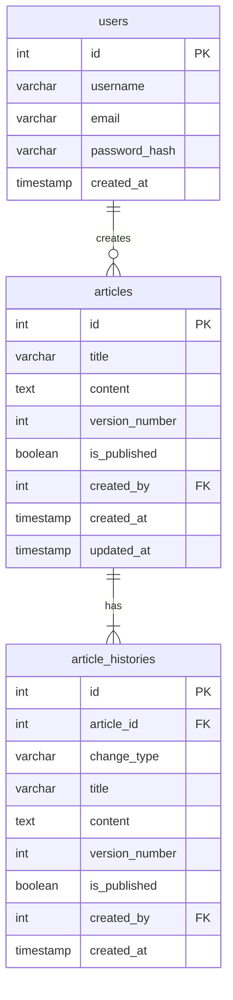

## 課題2-2

履歴データの表現には様々な方法があります。
ご自身が課題1の回答で採用した設計とは異なるアプローチでもUML図を作成してみましょう。
どのようなメリット/デメリットがあるでしょうか？

## 回答

### UML

- オーソドックスなミュータブルな設計

1. **記事の作成**
  - `articles`テーブルに新しいレコードを作成
  - `article_histories`テーブルに初期バージョンを保存

2. **記事の更新**
  - `articles`テーブルの`version_number`をインクリメント
  - `articles`の`title`と`content`を更新
  - `article_histories`テーブルに新しいバージョンを保存

3. **バージョンの変更**
  - `article_histories`から該当の`version_number`を取得
  - `articles`の`title`と`content`を更新
  - `articles`の`version_number`を更新

4. **記事の削除**
  - `articles`の該当レコードを削除
    - 履歴が不要な場合は、`article_histories`をカスケード削除
    - 履歴が必要な場合は、`article_histories`の`article_id`を削除して`Null`にする

### メリット/デメリット

#### メリット
- イミュータブルデータモデリングと比較し、直感的に理解できる
  - メンバーの理解が容易なため要件がシンプルな場合は適している
- テーブルの構造がシンプルなので扱いやすい
- パフォーマンス面で優れる

#### デメリット
- `article_histories`で持っているデータが冗長s
- 更新処理を伴うため、要件が複雑になると対応が難しい
  - カテゴリやタグなど要件が追加されると、テーブルが膨らむ

## 参考
- [データ活用のための履歴データの残し方を考える(アプリケーションDBモデリング編)](https://qiita.com/yterui/items/2fc2dd707704edfd93d6)
  - 今回課題としては、上記記事の下記に該当する手法を検討している
    - "イミュータブルデータモデリング"
    - "履歴テーブルを設け、データの作成・変更・削除の都度コピーする"
  - バイテンポラルデータモデリングでの設計もできそう
