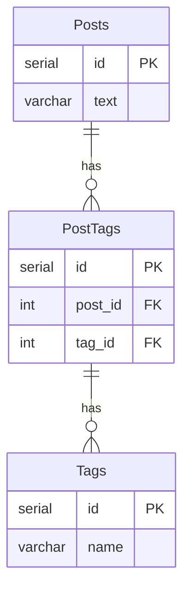

# アンチパターン 課題1-2

## 課題2-1

課題1の問題点を解決するよう、スキーマ設計を変更してみてください。

投稿に対するタグの情報をどのように保持するのが適切でしょうか？
新しいスキーマを考えて、DB設計のスケッチを描いてみてください。

## 回答

正規化されていないことが問題を引き起こす原因のため、
交差テーブルを導入し正規化する。

### Before

```mermaid
erDiagram
    Posts {
       id PK
      varchar text
      varchar tags
    }

```

### After




