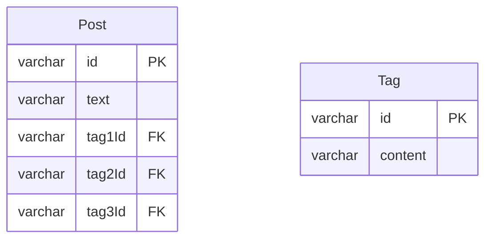

# 課題1-1

先程のPostの設計で生じた問題を解決するため、以下のようにテーブル設計を見直したとします。

Postに紐づくTagのidを複数のカラムで管理しています。

例えばタグAを一つ追加したら`tag1Id`のカラムにタグAのidが入るようなイメージです。
1つしかタグが紐づいていない場合、`tag2Id`と`tag3Id`はNULLとなるイメージです。

上記の設計だと、どのような問題が生じるか説明してください。



## 回答

- この設計パターンは、書籍`SQL Antipatterns`におけるCreate Multiple Columnsの例に該当する
- 第一正規系(`1NF`)に違反した設計になっている
  - この回答の問題点は、1NFに違反することの問題点とも言えそう
- この設計のデメリットには以下のものが考えられる

1. クエリの複雑さ
  - タグを指定して検索する場合、絞り込みのクエリを書くのが複雑になる
  -  具体的に、`tag1Id`, `tag2Id`, `tag3Id`のすべてに対して OR句、AND句を使って条件を指定する必要がる
    - 単一タグの検索例
      ```sql
      SELECT * FROM Post
      WHERE tag1Id = 'tagA' OR tag2Id = 'tagA' OR tag3Id = 'tagA'
      ```
  - 複数のタグの検索例
    - 複数タグの場合は、考えられるすべてのカラムの組み合わせを考慮する必要がある
    - ```sql
      SELECT * FROM Post
      WHERE (tag1Id = 'tagA' AND tag2Id = 'tagB') OR (tag1Id = 'tagB' AND tag2Id = 'tagA') ...
      ```
    - (IN句を使うことも可能)

2. 新しいタグの追加・更新の煩雑さ
  - Postに新しいタグを追加する際、どのカラム（`tag1Id`, `tag2Id`, `tag3Id`）が現在NULLか確認する必要がある
    - 空いているカラムを特定するためのSELECTクエリと、その後のUPDATEクエリと２段階の処理が必要になる
  - 特定のタグを削除する場合も、すべてのタグカラムに対して処理を行う必要があり、SQLが冗長になる

3. タグ数の制限
  - テーブルのカラム数が固定（この場合は3つ）されているため、Postに紐付けられるタグの最大数が制限される
  - タグの最大数を増やすには、テーブルに新しいカラムを追加する必要がある
  - タグの数を減らす場合、既存のカラムは残ったままになり、NULL値で埋められることになる

4. データの不整合と重複:
  - 同じタグが複数のカラムに設定されてしまう可能性がある
  - タグがない場合にNULLを格納する必要がある

5. インデックス設定
  - インデックスを設定する場合に`tag1Id`, `tag2Id`, `tag3Id`それぞれにインデックスを設定する必要がある
