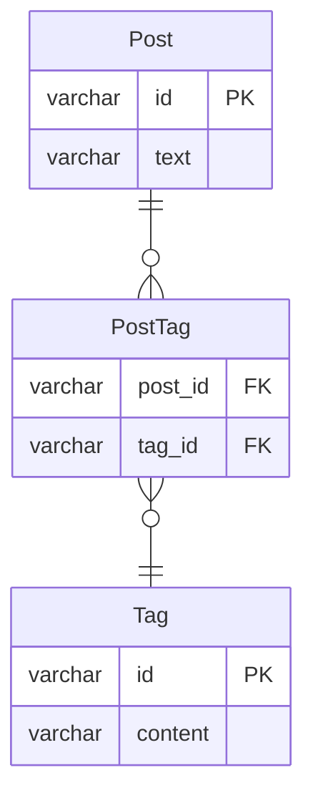

# アンチパターン 課題1-2

## 課題2-1

どのようにテーブル設計を見直せば課題1の問題は解決できるでしょうか？
新しいスキーマを描いてみてください。

## 回答

多対多の関係を適切に表現する交差テーブル（中間テーブル）を導入する。

```mermaid
erDiagram
  Post {
    varchar id PK
    varchar text
  }
  
  PostTag {
    varchar post_id FK
    varchar tag_id FK
  }
  
  Tag {
    varchar id PK
    varchar content
  }
  
  Post ||--o{ PostTag : ""
  PostTag }o--|| Tag : ""
```
