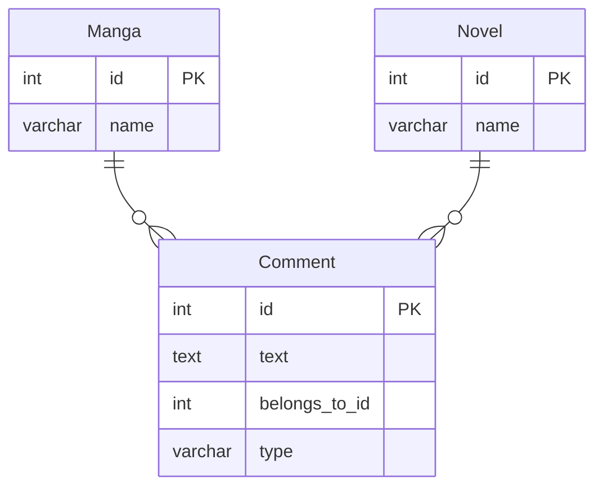

# 課題1-1

## 課題内容



## 回答

- この設計は「ポリモーフィック関連」（Polymorphic Associations）と呼ばれるアンチパターンに該当する
  - もしくは`Dual-Purpose Foreign Key`とも呼ばれる
- 1つのカラム（`belongs_to_id`）が複数のテーブル（`manga`と`novel`）を参照するため、以下の問題が発生する

### 問題点

- 外部キー制約を設定できず、参照整合性がないため、以下の問題が発生する  
  - **データベースレベルでの整合性チェックができない**  
    - アプリケーションコードで対応する必要がある  
    - 存在しない `manga_id` や `novel_id` が `belongs_to_id` に入る可能性  
    - `type` フィールドの値と実際の参照先が一致しない可能性  
      - 例えば、`type = 'manga'` だが実際には `novel_id` が入っているなどの不整合  
      - データベースがこの不整合をチェックできない  
  - **クエリが複雑化する**  
    - Commentのレコードごとに`type`フィールドの値によって結合するテーブルを変える必要がある
    - そのため、以下のような問題が発生する：
      - クエリを書く全ての場所で`type`フィールドの値をチェックする必要がある
        - クエリの複雑さが増す
      - データベースの制約ではなくアプリケーションコードで制約を実装する必要がある
        - バグのリスクが増える
    - JOINを使う例
      ```sql
      -- コメントとそれに関連する書籍（漫画/小説）の情報を取得
      SELECT 
        c.id AS comment_id,
        c.text AS comment_text,
        m.name AS manga_name,
        n.name AS novel_name
      FROM 
        Comment c
      LEFT JOIN 
        Manga m ON c.belongs_to_id = m.id AND c.type = 'manga'
      LEFT JOIN 
        Novel n ON c.belongs_to_id = n.id AND c.type = 'novel'
      ```
