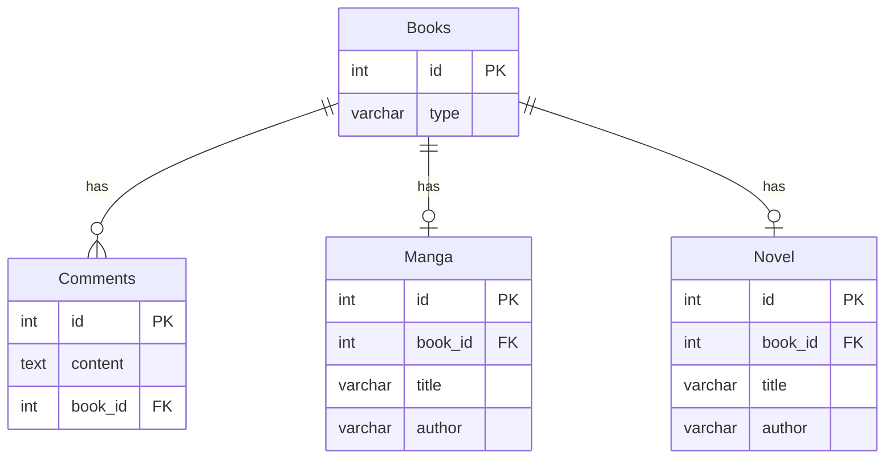

# 課題2-1

## 課題

どのようにテーブル設計を見直せば[課題1](/Database/08_sql_antipatterns3/課題1-1.md)の問題は解決できるでしょうか？
新しいスキーマを描いてみてください。

## 回答

- `Manga`と`Novel`の親テーブルである`Book`テーブルを作成し、そこに`Comment`を紐付ける
- 課題１の問題点だった参照整合性が確保される
  - `Comment`テーブルは`Book`テーブルのみを参照するため、外部キー制約を設定できる
  - 存在しない書籍にコメントが紐付くことはない
- `Manga`と`Novel`のレコードを`Book`テーブルに追加する必要があるため注意

