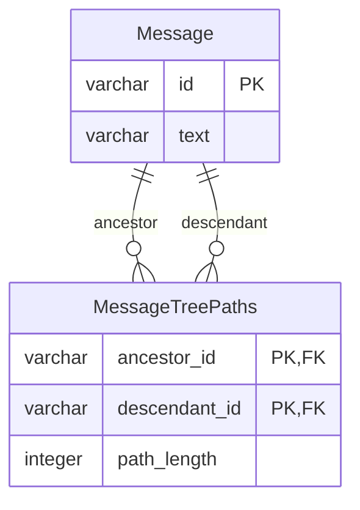

# 課題2-1

## 課題内容

どのようにテーブル設計を見直せば課題1の問題は解決できるでしょうか？
新しいスキーマを考えて、UML図を描いてみてください。

## 回答

- 閉包テーブル(Closure Table)という設計パターンを採用する
  - `Message`自体と階層関係を別々のテーブルで管理する
  - すべての祖先-子孫の関係を `MessageTreePaths`テーブルに記録することで、スレッド全体の取得が可能になる
  - メッセージAのすべての子孫を検索するクエリ
    ```sql
    SELECT m.* FROM Message m
    JOIN MessageTreePaths mtp ON m.id = mtp.descendant_id
    WHERE mtp.ancestor_id = 'A' AND mtp.path_length > 0;
    ```


