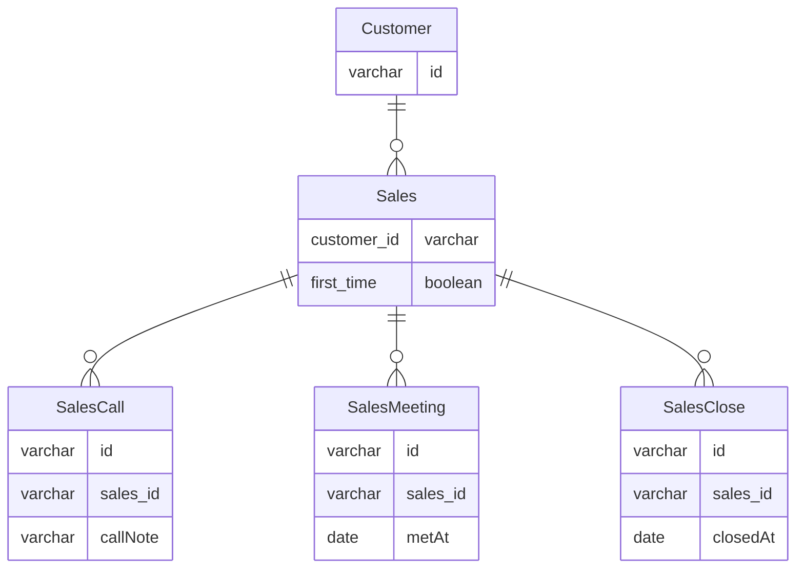

# 課題2-1

## 課題内容

どのようにテーブル設計を見直せば課題1の問題は解決できるでしょうか？
新しいスキーマを考えて、UML図を描いてみてください。

## 回答

- 下記のように顧客に従属する営業イベントテーブルを作成し、電話/面談/成約それぞれを営業テーブルで管理する
  - 電話/面談が複数回発生した場合も、複数レコードINSERTすることで記録できる
  - また、電話時点で商談不成立となった場合に不要なデータを記録する必要がなくなる
- 営業テーブルは新規開拓営業とリピート営業を区別し、電話/面談/成約テールブルは共通のテーブルで管理する想定

