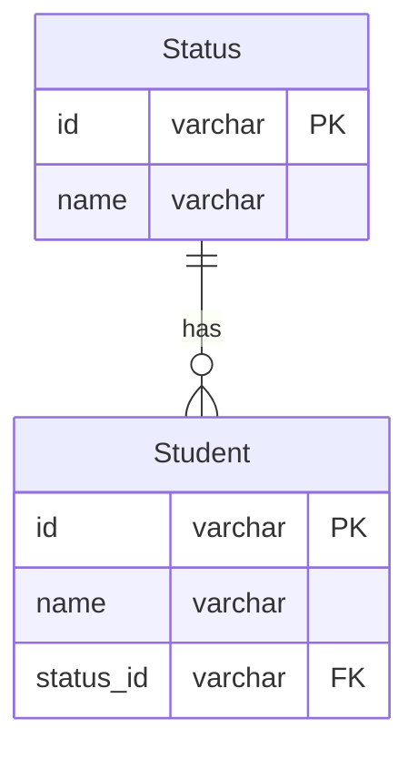

# 課題2-1

## 課題内容

どのようにテーブル設計を見直せば課題1の問題は解決できるでしょうか？
新しいスキーマを考えて、UML図を描いてみてください。

## 回答

ステータスの定義を別テーブルにマスタとして管理する

```mermaid
erDiagram
    Status {
        id varchar PK
        name varchar
    }

    Student {
        id varchar PK
        name varchar
        status_id varchar FK
    }

    Status ||--o{ Student : has
```
