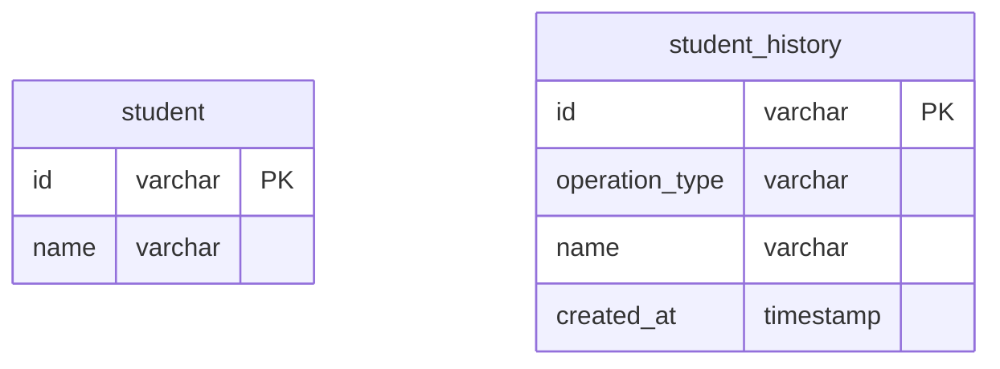
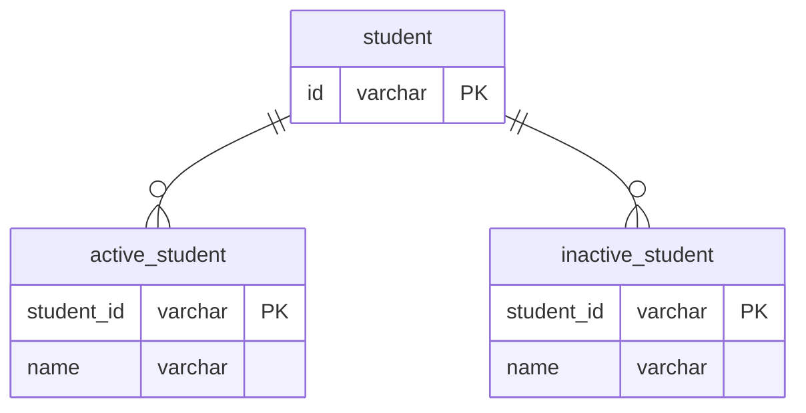

# 課題2-1

## 課題内容

どのようにテーブル設計を見直せば課題1の問題は解決できるでしょうか？
新しいスキーマを考えて、UML図を描いてみてください。

## 回答

### 1. 論理削除フラグを削除し、物理削除を行う

- 過去のデータが必要な場合は、履歴テーブルを用意する
  - operation_typeを用いて、INSERT, UPDATE, DELETEを区別する

### 2. 削除されたデータを別テーブルに移動する

- studentテーブルを親テーブルとして在籍生と退会生を子テーブルとする

