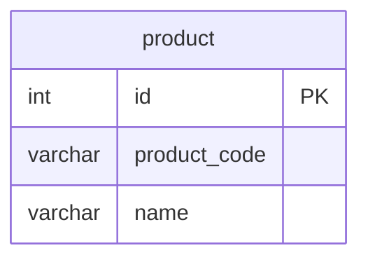

# 課題2-1

## 課題内容

どのような主キーを設定すれば、[課題1](/Database/12_sql_antipatterns8/課題1-1.md)の問題は解決できるでしょうか？

## 回答

- サロゲートキーを設定する
  - 自動生成される一意な整数値（`id`）を主キーとして設定する
  - 商品コードはカラムとして保持し、一意性制約（UNIQUE制約）を設定する

### サロゲートキーのメリット

1. **安定性と不変性**
   - サロゲートキーはビジネスルールの変更に影響されない
   - 一度割り当てられた主キーは変更されないため、外部キー参照の整合性が保たれる

2. **パフォーマンスの向上**
   - 整数型の主キーは、文字列型の主キーよりもインデックスのサイズが小さく、検索や結合が高速
   - データベースエンジンによる最適化がしやすい

3. **将来的な拡張性の確保**
   - ビジネスルールが変わっても、データベースの構造に影響を与えない
   - 例えば、商品コードの形式が変わっても、主キーは変更されない

### 自然キーのメリット

- 状況によっては自然キー（商品コードなど）を主キーとして使用する利点もある
- SQL Antipatternsでも`ID Required`として、すべてのテーブルに`id`という主キーを無条件に採用する事をアンチパターンとして取り上げている
- 自然キーのメリットには下記のようなものがある
  - 主キー自体が意味を持つため、ユーザーからの理解が容易
  - 外部システムとのデータ連携時に、主キーを変換する必要がない
